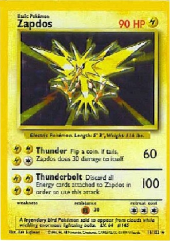

# ai-python-image-checker
# Card Scanner
### A card scanner built in Python using OpenCV
### Here are some examples of images before and after scan:
<br>


<br>

<br>




<br>

<br>


<br>

<br>


### Usage
```
input_image_path = "[image_name].jpg"
```
* to scan a image:
```
python cont.py
```